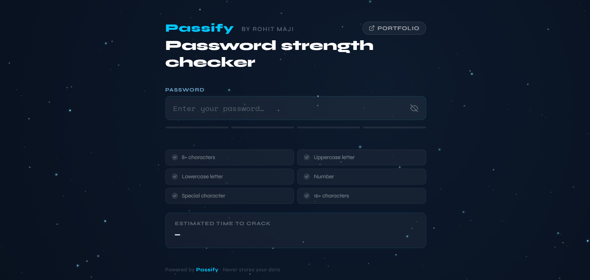
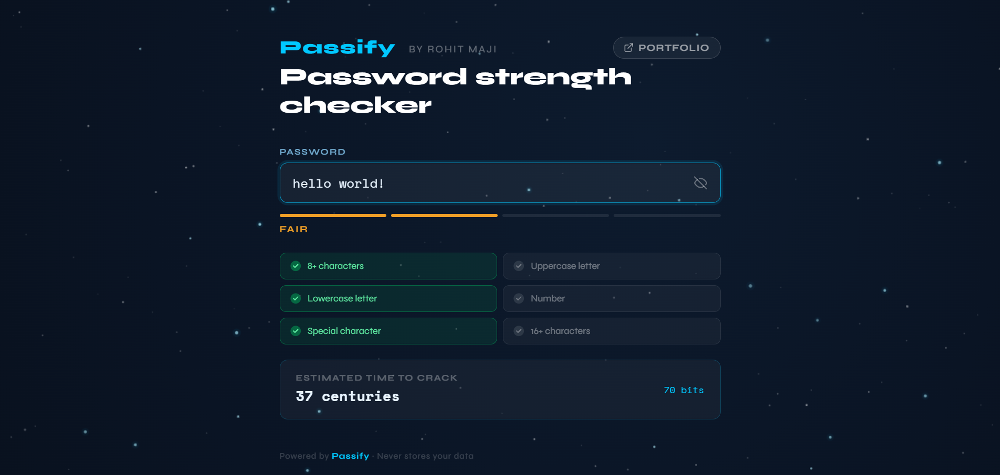
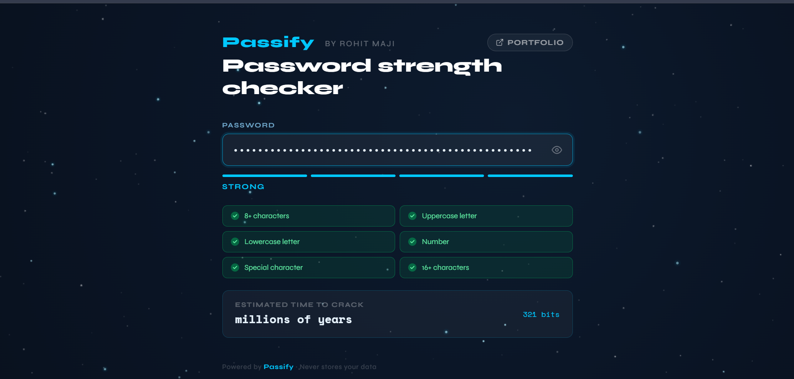

<div align="center">

<br/>

<pre>
██████╗  █████╗ ███████╗███████╗██╗███████╗██╗   ██╗
██╔══██╗██╔══██╗██╔════╝██╔════╝██║██╔════╝╚██╗ ██╔╝
██████╔╝███████║███████╗███████╗██║█████╗   ╚████╔╝
██╔═══╝ ██╔══██║╚════██║╚════██║██║██╔══╝    ╚██╔╝
██║     ██║  ██║███████║███████║██║██║        ██║
╚═╝     ╚═╝  ╚═╝╚══════╝╚══════╝╚═╝╚═╝        ╚═╝
</pre>

### 🔐 Passify — Password Strength Checker

**A sleek, privacy-first password strength checker with a dynamic space UI**

<br/>

[](https://rohitmaji22.github.io/Passify/)
[]


<br/>

</div>

---

## 🌌 Overview

**Passify** is a lightweight, fully client-side password strength analyzer that provides:

* Real-time feedback ⚡
* Entropy-based strength calculation 🧠
* Crack-time estimation ⏱️
* A visually engaging **space-themed UI** 🌠

> 🔒 **No data is ever stored or transmitted. Everything runs locally in your browser.**

---

## ✨ Features

* 🔐 Real-time password strength analysis
* 📊 Entropy calculation (bits-based security)
* ⏱️ Crack time estimation (GPU attack model)
* ✅ 6 advanced validation checks
* 👁️ Show / hide password toggle
* 🌌 Interactive starfield background (parallax effect)
* ☄️ Shooting star animations
* 🔒 100% client-side (zero backend)

---

## 📸 Preview

<p align="center">
  
  
  
</p>

---

## 🚀 Live Demo

👉 **Try it here:**
https://rohitmaji22.github.io/Passify/

---

## 🗂️ Project Structure

```
passify/
├── index.html       # UI structure
├── style.css        # Styling & animations
├── background.js    # Starfield & parallax logic
└── checker.js       # Password strength logic
```

---

## ⚙️ Getting Started

### Option 1 — Run directly

```bash
git clone https://github.com/rohitmaji22/Passify.git
cd Passify
open index.html
```

### Option 2 — Local server

```bash
python -m http.server 3000
# or
npx serve .
```

Open → http://localhost:3000

---

## 🧠 Core Logic

### 🔢 Strength Score

* Based on 6 conditions (length, case, digits, symbols, etc.)
* Score range: **0 → 6**

### 📊 Entropy Formula

```
entropy = length × log₂(character_pool)
```

### ⏱️ Crack Time

```
time = 2^entropy / 10^10 guesses/sec
```

---

## 🎨 Tech Stack

| Tech       | Purpose              |
| ---------- | -------------------- |
| HTML5      | Structure            |
| CSS3       | Styling & UI         |
| JavaScript | Logic                |
| Canvas API | Background animation |

> ⚡ No frameworks. No libraries. Pure performance.

---

## 🔐 Security Note

This tool is designed for **educational and awareness purposes only**.

* Does NOT store passwords
* Does NOT send data anywhere
* Safe for offline usage

---

## 📄 License

MIT License — free to use and modify.

---

## 👨‍💻 Author

**Rohit Maji**
🌐 https://rohitmaji.dev

---

<div align="center">

⭐ If you like this project, consider giving it a star!

</div>
